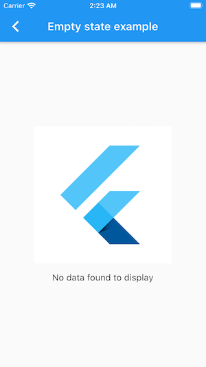
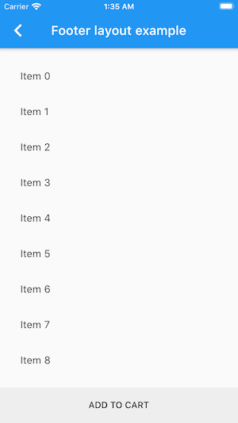
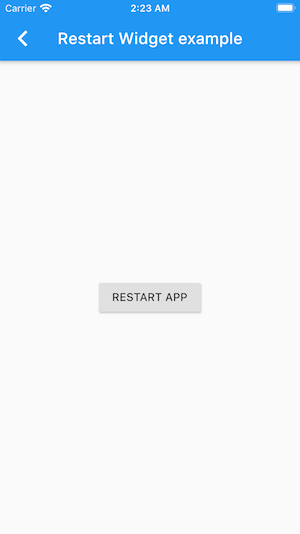
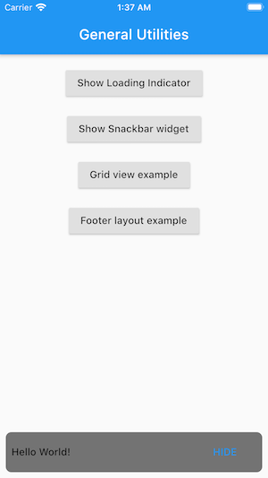
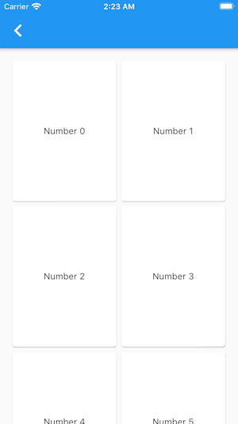
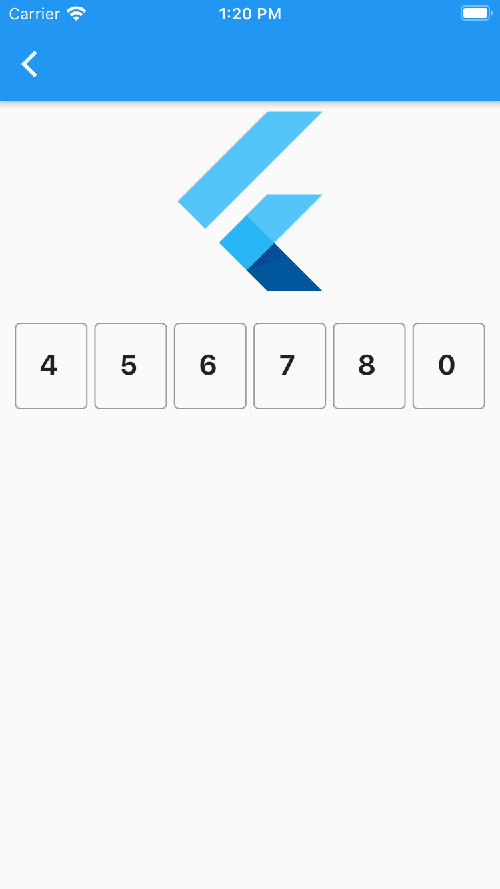

# General Utilities

A set of general utilities useful to any flutter project and help to reduce boilerplate code.

## Package contains

### Empty state widget

Display an empty state widget with an image and text for example if you don't have data to display

### Footer Layout

You can display a scrollable body and fixed bottom, for example a list of products and fixed ADD_TO_CART button.

### Restart Widget

It can be useful when you need to apply a new config on your app, for example I used this widget into toggle app language.

### Widget Route Animation

Use Navigator.push with passing this widget and pass a custom animation.

### Widget Animation

I used this widget with ListView to apply a beautiful looking on list items.

### Snackbar widget

An overlay widget to display customizable snackbar without scaffold.

### Space Widget

A useful widget to add vertical or horizontal spacing, you can use into ROWS or COLUMNS.

### Responsive Layout

Just add your Mobile and Tablet version of UI and this widget will choose which one to display upon the current screen size.

### Grid View Widget

An easy way to add grid view without boilerplate code, just pass list of widget as children.

### Otp Widget

Make it easy to enter auth otp

## Feel free to contribute and share useful widgets that prevent repetitive tasks.

